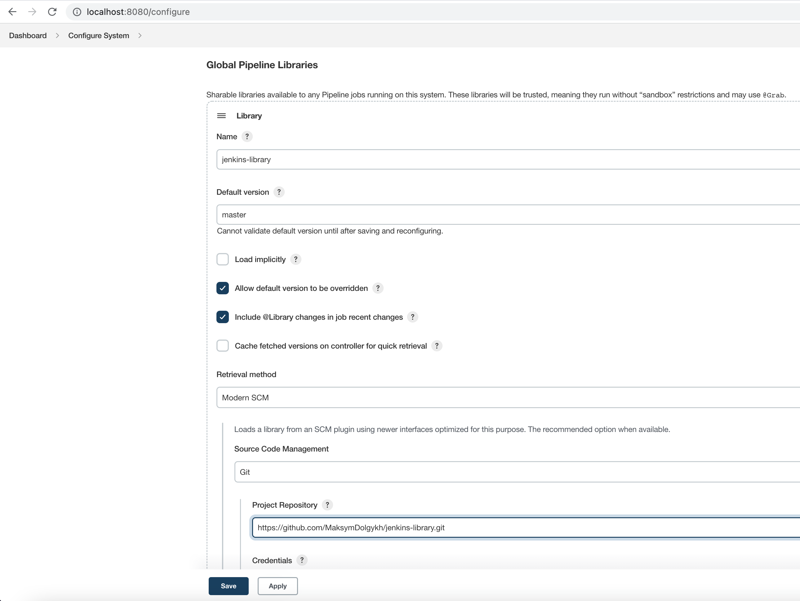
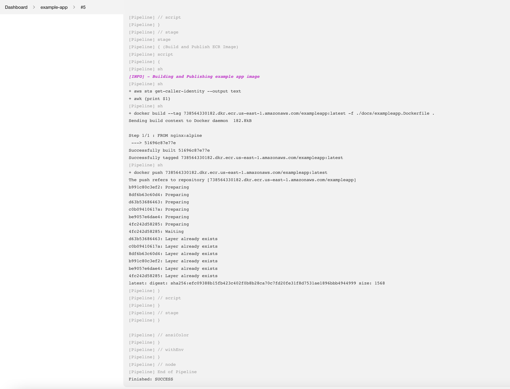

# jenkins-library

The collection of reusable methods and pipelines for jenkins. It is based on 
[jenkins-shared-library] functionality.

## Install
### Dependencies
Different parts how some dependencies. For instance, 
 * **font** and **logging** method "collections" depend on [jenkins-ansicolor-plugin]
 * **ecrUtils** depends on [aws-cli] and [docker-cli], so this things needs to be installed 
on the jenkins agent(s) running the job. 

### Setup as a "Global Pipeline Library"
To install it as a global shared library, open **_Manage Jenkins » Configure System_**
in jenkins web UI and find **_Global Pipeline Libraries_** block. You can add as many shared 
libraries as needed here, just press "Add" button and fill in required information:
 * **_Name_** is a library name by which you can then import things inside your pipeline. Must be unique.
For instance, the name could be "jenkins-library"
 * **_Default version_** it may be a branch name, tag, commit hash
 * For the **_Retrieval method_** just use "Modern SCM", "Git" and use URL to this repository 
(https://github.com/MaksymDolgykh/jenkins-library.git) in the **_Project Repository_** field

Something like on the screenshot below



Basically, that is it. Now you can import things from the shared jenkins library
inside your pipeline.
For more details about setup please look into [jenkins docs][jenkins-shared-library]

## Usage
There is usage example in this [Jenkinsfile](./docs/exampleapp.Jenkinsfile). In a nutshell 
you just need to import shared library with @Library annotation, like this
```groovy
@Library('jenkins-library@master') _
```
Then you can refer to methods defined in the vars/, something like
```groovy
ecrUtils.ecrLogin(["us-east-1"])
```

With the above example console output is going to look like



## License
This project is licensed under the Apache License 2.0 ([LICENSE](./LICENSE.TXT))


[jenkins-shared-library]: https://www.jenkins.io/doc/book/pipeline/shared-libraries/
[jenkins-ansicolor-plugin]: https://plugins.jenkins.io/ansicolor/
[aws-cli]: https://aws.amazon.com/cli/
[docker-cli]: https://docs.docker.com/get-docker/
